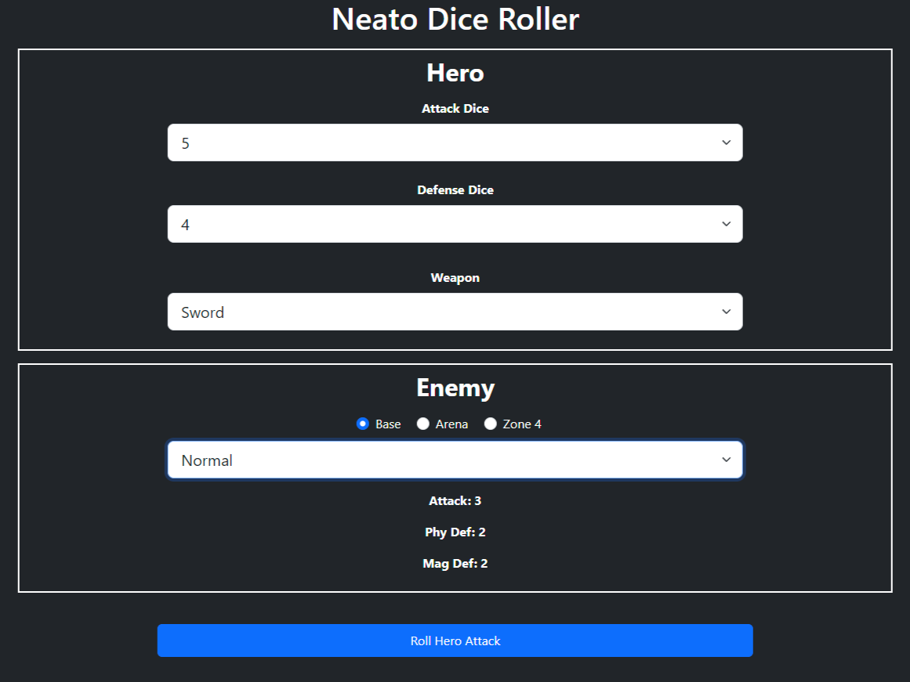
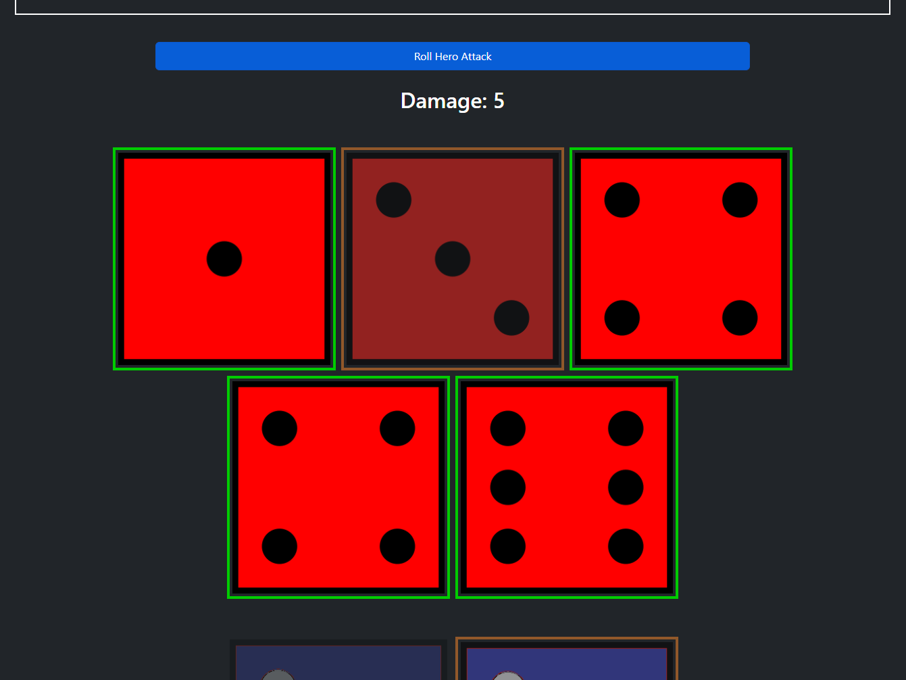

# dice-roller

## Description

This is a test for a dice rolling companion app. It uses JavaScript logic to roll a number of attack and defense dice and calculates damage based on the enemy's stats and the weapon being used. This is a possible precursor to a native mobile companion app for board games.

## Installation

No installation needed.

## Usage

Open the app in a browser. Player hero attack dice, defense dice, weapon, and current enemy can be selected from the dropdown menus. Click to roll for an attack, which will be tabulated and rendered. Player can also click to be counter attacked by the selected enemy.

Link to deployed application: https://ktunebe.github.io/dice-roller/

## Credits

N/A

## License

N/A

## Questions

Any questions about this application should be directed to:

GitHub: https://github.com/ktunebe

Email: ktunebe@gmail.com
